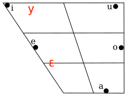

```{r setup, include=FALSE}
`%>%` <- magrittr::`%>%`
```
# Letter 

The process of perception of an unfamiliar speech sound is theorized to involve a comparison of the unfamiliar sound to representations of familiar sounds, that is sounds that have been heard repeatedly in the past.  However, research testing the ability to discriminate an unfamiliar sound often focuses on the difference betweeen the unfamiliar sound and the one familiar sound that is determined to be the "nearest" sound in perceptual or acoustic space.  This narrow focus on the one nearest sound ignores the rest of a large and often crowded represetation space.  

This is important because it is known that sound inventories of language are not random in their geometric shape, but instead can be measured to have global and local symmetry and economy, above and beyond what would be expected by chance. (Dunbar & Dupoux 2016).   We ask: does the shape of the entire sound inventory affect discirmination of an unfamiliar sound, above and beyond the effect of distance to the nearest sound? Our research has implications for theories of language change and second language acquisition and practical applications in language teaching. 


The study has been approved by  the Comité d’Éthique de la Recherche  of Université Paris Decartes as of June 13, 2019.  All funding for participant payment is covered by the Agence National de Récherche grant numbers ANR-17-CE28-0009 (GEOMPHON) and  ANR-10-LABX-0083 (EFL).   Web hosting for the online studies will be provided by the Laboratoire de Linguistique Formelle.  The study is ready to commence immediately.  

Data collection for the English speakers will take a maximum of one week to complete. Based on previous studies we expect recruitment of French participants will take longer, but we anticipate being able to run all participants within a two week window. Once data is collected all code is in place to immediately run models and create vizualizations.  At this point we will take one further week to move from a stage 1 manuscript to a stage 2 manuscript. The total time anticipated to go from in principle approval to stage 2 manuscript is one month.  

We agree to participate in the Open Peer Review system.  

Following Stage 1 in principle acceptance, we agree to register the approved protocol on the Open Science Framework either publicly or under private embargo until submission of the Stage 2 manuscript.  

If we should withdraw the paper following in principle acceptance, we agree to the publicaiton of a short summary of the pre-registered study as a Withdrawn Registration.  


appropriate reviewers with expertise in linguistics and Bayesian Methods include:  

Jeff Mielke  
Timo Roettger  
Bodo Winter  
Till Poppels  


# Introduction
### background 
Over a lifetime of speech perception, humans fine-tune their sensitivity to phonetic differences that are contrastive in their native language.  When listeners hear a new phone, be it a phone from a new language or a variant they have not previously encountered, they are faced with the task of perceiving new sounds with a perceptual system that is tuned to their native language and dialect.   There is extensive research investigating precisely how this is accomplished. In formal models of language learning such as the Speech Learning Model (Flege) and the Perceptual Assimilation Model (Best,1995, Best & Tyler 2007), an important concept that has arisen from past work is the distance of the unfamiliar sound to the nearest familiar sound in the native inventory.  Unfamiliar sounds will be hard to discriminate from a familiar sound that is close, and easier to discriminate from a familiar sound that is farther away.

What makes two sounds "close" or "far away" is defined in different ways: principally, as either an objective acoustic distance measured on some element of an acoustic signal, or as a perceptual distance which can be measured through discrimination tasks. However, a narrow focus on the distance between one familiar sound and one unfamiliar sound ignores the crucial fact that phonetic space is crowded for most sound inventories. If we consider representations in a continous acoustic space, an unfamiliar sound which is "far" from one familar sound may also be "near" to other sounds. A familiar example is to look at the vowel space, mapped by the first formant vs second formant. The inventory of Spanish has five vowels (below, in black), and when vizualized in an f1 vs f2 they show somewhat even spacing, and a symmetrical distribution.  Let us imagine a Spanish speaker who is encountering French sounds for the first time and is attempting to add them to their mental representation.  Some french sounds will be very similar acoustically to sounds already exsisting in their inventory, and some will be very different. Also, adding a new sound to their already established inventory of sounds will also change the arrangement of sounds in the inventory. In the case of the added sounds here (in red, below),both /y/ and /ɛ/ have a similar distance to the nearest sounds in the native inventory.  However, adding /ɛ/ only does not substantially change  the symmetry of the system and creates an inventory with similar distance between each sound, whereas adding /y/ only creates an inventory that is unbalanced, has less symmetry, and has greater variation in the distances between sounds.  

 

This leads us to the question: Is accuracy in discriminating a new sound principally driven by acoustic distance to the nearest sound in the native inventory?  Or does the change in shape of the inventory also play a role?

We follow this line of inquiry because of previous work indicating that sound inventories are not random in their distribution of sounds (Dunbar & Dupoux 2016). Dunpar & Doupoux (2016) develop three measurements which encompass these tendencies:

1) economy ("Econ"): if two inventories have the same number of sounds, those sounds tend, all things being equal, to require relatively few features to characterize.  

2) local symmetry ("Loc") : if two inventories have the same number of sounds, using the same number of features, those sounds tend to make relatively many "minimal oppositions" between pairs of sounds, which differ only in one feature.  

3) global symmetry ("Glob"): if two inventories are matched geometrically on the other two properties, they tend to have sounds that are more symmetrically distributed.	

Because these metrics measure the geometry of an entire inventory,  we call these measures "geomphon scores." Unlike the toy example above displaying an inventory in a continuous f1-f2 space, these scores are based on discrete discrete phonological features, and visualise inventories as n-dimensional hypercubes. This allows the scores to take into account far more features than the simple two-dimensional diagram above.  Details of the precise method are available in Dunbar & Dupoux (2016).  While Dunbar & Dupoux establish that sound inventories of the worlds languages maximize these properties above and beyond the distribution expected by chance, they do not establish *why* inventories maximize these scores.  One possible reason is that inventories that maximize these scores are optimal for discrimination of sounds within an inventory.  This would lead to the prediction that a change in inventory that reduces one of these scores would lead to worse discrimination, when compared to a change in inventory that increases one of these scores. 

The motivation for this experiment is to test whether the relation of all the sounds in a phoneme inventory affect perception of a given unafamiliar sound.  Specifically, we test whether changes in geomphon scores are predictive of discrimination accuracy, above and beyond the effect of the acoustic distance to the one nearest sound in the inventory.   

To accomplish this we collect discrimination data from an ABX task. That is, listeners hear one sound ("A"), then another sound ("B"), and then a new instance of one of the previously heard sounds ("X").  Each AB pair of sounds includes one sound that is familiar (= part of the native inventory of participants), and one sound that is unfamiliar (= not part of the native inventory of participants). For each pair of sounds, we calculate the acoustic distance between sounds, and also the change in geomphon scores if the unfamiliar sound were added to the native inventory. (see more detail in Method, below)  In brief, our hypotheses are as follows:

### Hypothesiss 
We hypothesize that changes in Econ, Glob, and Loc will each be predictive of discimination accuracy, above and beyond the effect of acoustic distance.   

### Predictions and operationalization of hypotheses
 Predictions  
 
 1) For each trial with sounds A, B, and X(an instance of either A or B),  we will measure the acoustic distance between A and X, and between B and X. If these distances are similar, we predict the task will be hard because this indicates that X is similar to both A and B. If, however, one of the distances is much greater than the other, it will be obvious which sound X is an instance of, and the task will be easy.  In short, we predict that the larger the difference between the measured distances (A->X) and (B->X), the higher the discrimination accuracy will be. 
 
 2) Each trial ABX will have one unfamiliar sound. Each unfamiliar sound will be given a value for how much it would change geomphon scores if it were added to the native inventory. We expect that the more a sound would cause a negative change in a geomphon score, the lower the discrimination accuracy for that sound will be.  
 
This will be analyzed using a generalized linear model with a logistic link function, implemented in a Bayesian framework.  The dependent variable will be participant accuracy. The predictors of interest will be the change in each of the geomphon scores, and the difference in acoustic distances for the two sounds in each trial.  We expect  the effect will vary by subject and by item and so we intend to include the maximum random effects structure justified by the design.  In R syntax, the model would be written as follows:  

Accuracy ~  Change_in_econ + Change_in_glob + Change_in_loc + difference_between_acoustic_distances + (1 + Econ+glob + Loc + acoustic_distance|subject) + (1|item)


# Method

Code sufficient to launch a direct replication, including all demographic surveys, instructions, and stimuli, can be found here:
-->PERSISTENT URL. 

summary of method: (more details below) The experiment is presented via an internet webrowser. Participants first read a consent form and indicate their consent. Then participants fill out a demographic survey.  In each trial, participants hear one sound ("A"), then another sound ("B""), and then a new instance of one of the previously heard sounds ("X").They are asked to indicate whether the last sound was more similar to the first sound, or to the second sound.  They indicate their choice using the keyboard.  Each trial is marked correct or incorrect. 


## sample 
#### population 
 Participants will be recruited in three venues:  
 
1) English speaking participants will be recruited on Amazon Mechanical Turk, with qualifications set to:  
    * location is US  
    * approval rate 95% or higher  
    * have completed > 100 HITS  
    * following mechanical turk's policies, all Amazon Mechanical Turk participants are > 18 years of age  

2) French speaking paricipants will be recruited recruited on Amazon Mechanical Turk, with qualifications set to:   
    * location is France  
    * approval rate 95% or higher  
    * have completed > 100 HITS  
    * following mechanical turk's policies, all Amazon Mechanical Turk participants are > 18 years of age
    
3) French speaking participants will also be recruited through an email list ("RISC") and the Facebook groups that focus on recruiting volunteer subjects for linguistics and Psychology research.  Speakers recruited through email and Facebook will not be paid. 

#### number of subjects 
We will sample 90 subjects. see "Model Validation"" section below for how we arrived at this number.  
  
#### Inclusion and exclusion criteria
Each participant will answer a demographic survey designed to determine their eligibility.  To incentivize truthful behavior in online participants, all Mechanical Turk participants will be paid regardless of their answers.

Data from any subject who meets **any** of the following criteria will be **excluded**.  

1) They answer "No" to question "Do you consider yourself a native speaker of English?"  (/French for french speakers )  

2) they answer "Yes" to the question: "Did you have significant exposure to a language other than English in your childhood?  Respond yes if, before age 8, you were exposed to another alnguage during a long period (at least 1 year)
This could include living in another country where this language was spoke, or having a caregiver who consistently spoke to you in this language.  Respond no if you were only exposed briefly, for example by watching TV or movies in this other language, or occasional visits to family"

3) accuracy of less than 80% on the set of ten check questions (ten ABX trials specifically designed to be easy, based on acoustic distance and former pilots)

We will run  a batch of 90 subjects and then filter the data by the  to determine the number of subjects that pass all criteria.  We will then run batches of size (90 - number who have already passed the above criteria) until we reach 90 subjects.  Each batch of data will be posted to OSF in raw, anonymized format on the day of collection, before a new batch is collected. 

## Stimuli 

##### Choice of unfamiliar language:  
 For practical reasons our discrimination experiments are to be run with English and French listeners, and therefore it was necessary to find a language which has some sounds that are similar to sounds in the inventory of French and English, and some sounds that are highly dissimilar. In addition, the unfamilar sounds should involve the best spread of each geomphon score, as well as acoustic distances. 

While geomphon scores can be calculated based on a full inventory of consonants and vowels,  practically speaking, discrimination between pairs of sounds consisting of one vowel and one consonant would yield ceiling level accuracy and be uninformative for our research question. We therefore chose to use only consonants. 

Dunbar and Dupoux calculated Geomphon scores for **N** languages and the feature matrices used to do this are available **here**.  For the purposes of choosing a language, we were interested not in the geomphon scores of the entire inventory, but rather the *change* in geomphon scores if sounds from a new inventory were added to either English or French.  For each sound in an unfamilar language, we calculated the change in geomphon scores from the base value for English compared to the value for English if the sound in question was added to the inventory. **(and french?)**   (For details of how the scores were calculated, see section "Calculation of geomphon scores" below)

We identified Hindi as the best canditate lagnauge because it was a language that has many consonants that are familiar to French and English speakers (e.g. /n/,/m/, /b/, /j/), and also many that are unfamiliar (in particular, retroflex sounds,  and voiced aspirated stops). It also showed variation in the change in geomphon scores, and is a language for which we would be able to recruit model speakers in France and the United States. 
 
##### Procedure for recording of stimuli: 
 
5 Hind-Urdu speakers (3 female) were recorded in a sound attenuated booth in either the Université de Paris or the University of Massachusetts.   All reported that Hindi was the principal language they spoke with their family as children.  The primary motivation for using multiple speakers was to introduce variability and noise into the experiment, and so the speakers were not controlled for sociolinguistic factors (e.g. age, place of birth,etc.) Each speaker was paid  $20/€20 for their recording and signed an informed consent form.  
 
 Participants spoke all consonants of Hindi in a pseudoword /a_a/ context.  Each pseudo word was written on a list in Devanagri and latin script, with a sample word in Devanagri including the target consonant sound.  For elicitation purposes each pseudoword was said in a sentence context "kripya ____ kahie" (कृपया_____कहिए") ("please bring _____"). Speaker 1 recorded all peseudowords once.  Speakers 2-5 recorded all pseudowords twice.  The  first time, speakers 2-5 listened to speaker 1, and then paused the recording and repeated after Speaker 1.  They were told to try to repeat at about the same pace.  Recordings are considered individually identifiable information and so are not available publically, but are approved for sharing for research purposes, including replication. To obtain access to the files email ewan.dunbar@univ-paris-diderot.fr.  

Textgrids for all recordings were created using forced alignment using **the Penn forced aligner**. Transcripts, code, and textgrids are available at **URL**.  All textgrids were hand checked and ajusted for accuracy through visuali in Praat, and all splice points were moved to the nearest zero crossing.  
 
 
#### procedure for building and selecting stimuli 
 
Each stimulus tests one pair of phonemes.  One member of the pair is a familiar sound, and one member is an unfamiliar sound.   The "familiar" sounds were phonesthat are included in both French and English inventories (i.e. would be transcribed as the same IPA symbol in French, English, and Hindi).  The familiar sounds are listed below: 
/b,d,g,p,t,k,v,ð,z,s,d͡ʒ,t͡ʃ,n,j,ɾ,h,ʃ/
**note that ð,d͡ʒ,t͡ʃ, are not familiar in french??**

The unfamiliar sounds, on the other hand, were sounds which are  present in the inventory of Hindi but unambiguously absent in both French and English.  The unfamiliar sounds are listed below:

/bʰ,d̪ʰ,ɖ,ɖʰ,dʒʰ,ɡʰ,ɳ,ɽ,ʈ/

Each unfamiliar sound was paired with the familiar sounds which were judged by the authors to be most likely to be confused in dsicrimination, i.e. to be most similar in perception.  Examples of the pairs formed for the unfamiliar sounds /bʰ/, /ʈ/, and /ɳ	/ are below:  

#add four and only four pairs here. 
bʰ	b
bʰ	d
bʰ	g
bʰ	p
ʈ	t
ʈ	d
ɳ	n
ɳ	j


It is important to clarify that both the familiar and unfamiliar sounds were spoken by the Hindi speakers.  Because they were spoken by Hindi speakers, the "familiar" sounds may differ systematically from the English and French version of these sounds. The rationale for recording in this way was to have consistency in the context surrounding the phone of interest.  If instead English speakers recorded the English consonants and Hindi speakers the Hindi consonants, the surrounding vowels have the potential to give additional cues useful for discrimination and push discrimination towards ceiling, **as  we found in previous pilot X**. While the "familiar" sounds may differ slightly from their versions in English and French, the unfamiliar sounds were chosen to be much further than unfamiliar sounds in acoustic distance and phonological features.   (**and indeed our measurements confirm this**). 


Selection of stimuli was based on four things:  

1) acoustic distances 
     a) distance to target <  distance to other 
     b) based on ratio of differences is not so large as to create only ceiling performance
         --> currently: log ratio is > -.4)
         
2) Domain knowledge 
    d) rule out stimuli that do not sound good to phoneticians 
         -->remove velar fricatives, which were not native to our speakers' (and in deed most hindi, rather than urdu speakers) dialects
    e) attempt to balance stimuli by linguistic categories 
         --> sample one instance from each phone pair before further sampling to arrive at 150 stimuli
         
4)experimental balance
   f) once all above filters have been applied to select pairs, list of triplets is submitted to 
   simulated annealar script which will optimize a stimuli list that  has the best combinations 
   that decorrelate speaker combination from phone pair.

Once the pairs of phonemes were chosen, it was necessary to combine recordings of the sounds to create ABX trials. An ABX trial consists of a sound (A), a different sound (B), and then a repetition of either A or B (the X, which participants match to either A or B).  For a trial with a given pair of phonemes, it is necessary to determine the order of the phonemes, which sound is the target, and which speaker's recording is used.  The number of trials was constrained to no more than 150 based on time estimates of previous experiments.  Given the number of permutations of these options it is not feasible to simply counterbalance all combinations of order, target phone, and speaker within the number of trials. 

#CHECK TRIALS

##so instead what did we do


## construction of stimuli 
Once the design is decided, each recording is spliced togehter with **______ ISI bewteen A&B and B& X**.  Each

### calculation of geomphon scores 
details here? 


### experimental procedure

##specify how did stuff, including randomization

 


#Statistical Model 

##model specifications 

####  covariates 
the covariates in the model are acoustic distance, and the three geomphon scores 

##acoustic distance 
acoustic distance is a simple concept intuitively but may be operationalized in many ways, or be based on many features 

We tested the predictive ability of of two measures of acoustic distance in our pilot data: 
MFCCs
"bottleneck features"  **how calculated**
We found that in all three pilots, there is a clear advantage for the multilingual
bottleneck features over MFCC features in predicting the human responses.
(for further details on the selection process see **linktormd** )

We draw on three sets of ABX phone discrimination pilot data:

- **Pilot-a:** Cross-linguistic (English/French) ABX phoneme experiment, lab speech, three speakers A-B-X, presented to English and French listener groups
- **Pilot-b:** TIMIT ABX phoneme experiment, from corpus, three speakers A-B-X, presented to English and French listener groups
- **Pilot-c:** English lab speech ABX phoneme experiment, two speakers AB-X, presented to English and French listener groups

```{r load-pilot-a, include=FALSE}
pilot_a_human <- tibble::as_tibble(read.csv("data_nika_human.csv",
                                            row.names=1)) %>%
  dplyr::mutate(listener_group=ifelse(subject_language.x == "eng",
                                      "English", "French"))
pilot_a_bottleneck <- readr::read_csv("data_nika_bottleneck.csv",
                                      col_types=readr::cols()) %>%
  dplyr::rename(bn_TGT=bottle_tgt_x, bn_OTH=bottle_oth_x) %>%
  dplyr::mutate(delta_bn=bn_TGT-bn_OTH, ratio_bn=bn_TGT/bn_OTH)
pilot_a_mfcc <- readr::read_csv("data_nika_mfcc.csv",
                                col_types=readr::cols()) %>%
  dplyr::rename(mfcc_TGT=mfcc_tgt_x, mfcc_OTH=mfcc_oth_x) %>%
  dplyr::mutate(delta_mfcc=mfcc_TGT-mfcc_OTH, ratio_mfcc=mfcc_TGT/mfcc_OTH)
pilot_a <- dplyr::left_join(pilot_a_human, pilot_a_bottleneck, 
                            by="tripletid") %>%
  dplyr::left_join(pilot_a_mfcc, by="tripletid")
```

```{r load-pilot-b, include=FALSE}
pilot_b_human <- readr::read_csv("data_timit_human.csv",
                                      col_types=readr::cols()) %>%
  dplyr::mutate(tripletid=sapply(strsplit(tripletid, "_"),
                                 function(x) x[2])) %>%
  dplyr::mutate(listener_group=ifelse(subject_language == "English_turkers",
                                      "English", "French"))
pilot_b_meta <- readr::read_csv("data_timit_meta.csv",
                                col_types=readr::cols())
pilot_b_bottleneck <- readr::read_csv("data_timit_bottleneck.csv",
                                      col_types=readr::cols()) %>%
  dplyr::rename(bn_TGT=distance_TGT, bn_OTH=distance_OTH) %>%
  dplyr::mutate(delta_bn=bn_TGT-bn_OTH, ratio_bn=bn_TGT/bn_OTH)
pilot_b_mfcc <- readr::read_csv("data_timit_mfcc.csv",
                                      col_types=readr::cols()) %>%
  dplyr::rename(mfcc_TGT=distance_TGT, mfcc_OTH=distance_OTH) %>%
  dplyr::mutate(delta_mfcc=mfcc_TGT-mfcc_OTH, ratio_mfcc=mfcc_TGT/mfcc_OTH)
pilot_b <- dplyr::left_join(pilot_b_human, pilot_b_bottleneck, 
                            by="tripletid") %>%
  dplyr::left_join(pilot_b_mfcc, by="tripletid") %>%
  dplyr::left_join(pilot_b_meta, by="tripletid") %>%
  dplyr::mutate(user_corr=ifelse(presentation_order == "AB",
                                 first_sound, second_sound))
```

```{r load-pilot-c, include=FALSE}
pilot_c_human <- tibble::as_tibble(
  read.csv("data_lab_human.csv", row.names=1)) %>%
  dplyr::mutate(listener_group=subject_language.x)
pilot_c_bottleneck <- readr::read_csv("data_lab_bottleneck.csv",
                                      col_types=readr::cols()) %>%
  dplyr::rename(bn_TGT=distance_TGT, bn_OTH=distance_OTH) %>%
  dplyr::mutate(delta_bn=bn_TGT-bn_OTH, ratio_bn=bn_TGT/bn_OTH)
pilot_c_mfcc <- readr::read_csv("data_lab_mfcc.csv",
                                      col_types=readr::cols()) %>%
  dplyr::rename(mfcc_TGT=distance_TGT, mfcc_OTH=distance_OTH) %>%
  dplyr::mutate(delta_mfcc=mfcc_TGT-mfcc_OTH, ratio_mfcc=mfcc_TGT/mfcc_OTH)
pilot_c <- dplyr::left_join(pilot_c_human, pilot_c_bottleneck, 
                            by="tripletid") %>%
  dplyr::left_join(pilot_c_mfcc, by="tripletid")
```


```{r hindi_stim_selection, echo = FALSE, messages = FALSE,include=FALSE}
hindi_design_long <- readr::read_csv("hindi_design_long.csv")
hindi_design_long <- dplyr::mutate(hindi_design_long,response_var = 0) %>%
                     dplyr::mutate(., ratio_distance=distance_TGT/distance_OTH) %>%
                     dplyr::filter(., phone_TGT != "ɣ"& phone_OTH != "ɣ" & phone_X != "ɣ") %>%
                     dplyr::filter(., phone_TGT != "x"& phone_OTH != "x" & phone_X != "x")


proposed_hindi <- dplyr::filter(hindi_design_long,distance_OTH>distance_TGT) %>%
                   dplyr::mutate(., ratio_distance=distance_TGT/distance_OTH) %>% 
                   dplyr::mutate(., log_ratio_distance= log(distance_TGT/distance_OTH))%>%
                   dplyr::filter(., log_ratio_distance > -.4) %>%
                   dplyr::mutate(., phone_pair =paste0(as.character(phone_TGT),
                                      "_",
                                      as.character(phone_OTH))) %>%
                   dplyr::group_by(., phone_pair)%>%
                   dplyr::sample_n(size = 1) %>%
                   dplyr::ungroup() %>%
                   dplyr::sample_n(size = 150)


pilot_a_bn_ratio_m <- lme4::glmer(user_corr ~ ratio_bn + (1|tripletid) + (1|subject_id),
                            data=pilot_a, family="binomial")
pilot_b_bn_ratio_m <- lme4::glmer(user_corr ~ ratio_bn + (1|tripletid) + (1|subject_id),
                            data=pilot_b, family="binomial")
pilot_c_bn_ratio_m <- lme4::glmer(user_corr ~ ratio_bn + (1|tripletid) + (1|subject_id),
                            data=pilot_c, family="binomial")
                   
```


We vizualize below 

```{r proposed_stim_sampling,include=FALSE}

mean_intercept <- mean(lme4::fixef(pilot_a_bn_ratio_m)[[1]],
                       lme4::fixef(pilot_b_bn_ratio_m)[[1]],
                       lme4::fixef(pilot_c_bn_ratio_m)[[1]])

mean_coef_dist <- mean(lme4::fixef(pilot_a_bn_ratio_m)[[2]],
                       lme4::fixef(pilot_b_bn_ratio_m)[[2]],
                       lme4::fixef(pilot_c_bn_ratio_m)[[2]])
  
long_hindi_m <- glm(response_var~ratio_distance, data=hindi_design_long, family="binomial", maxit = 100)
    long_hindi_m$coefficients["(Intercept)"]<- mean_intercept
    long_hindi_m$coefficients["ratio_distance"] <- mean_coef_dist
  
##### repeat design for N subjects and add summary accuracy score
NUM_SUBJS = 60

long_hindi_subjs<- hindi_design_long[rep(1:nrow(hindi_design_long),NUM_SUBJS),]

    subjs<- c()
      for (i in (1:NUM_SUBJS)) {
        subjs[i] = paste("subject",i,sep = "_")
      }

subjs_rep<-as.data.frame(rep.int(subjs,nrow(hindi_design_long)))
names(subjs_rep)<-c("subject")

long_hindi_subjs <- dplyr::bind_cols(subjs_rep,long_hindi_subjs)

pred_prob <- predict(long_hindi_m, type="response", newdata=long_hindi_subjs)
    
      for (i in 1:nrow(long_hindi_subjs)) {
          long_hindi_subjs[["response_var"]][i] <- sample(c(0,1), 1,
                                         prob=c((1-pred_prob[i]), pred_prob[i]))
        }


long_hindi_acc_by_phone_pair <- long_hindi_subjs %>%
  dplyr::mutate(., phone_pair =paste0(as.character(phone_TGT),
                                      "_",
                                      as.character(phone_OTH))) %>%
  dplyr::mutate(., log_ratio_distance=log(distance_TGT/distance_OTH)) %>%
  dplyr::mutate(., ratio_distance=distance_TGT/distance_OTH) %>%
  dplyr::group_by(.,phone_pair,log_ratio_distance,ratio_distance) %>%
  dplyr::summarize(accuracy=mean(response_var))

                
ggplot2::ggplot(long_hindi_acc_by_phone_pair, ggplot2::aes(x=log_ratio_distance, y=accuracy)) +
  ggplot2::geom_point() +
  ggplot2::geom_smooth()+
  ggplot2::geom_vline(xintercept=0.0) +
  ggplot2::geom_hline(yintercept=0.5) +
  ggplot2::ggtitle("Log distance ratios versus accuracy by phone pair") +
  ggplot2::xlab("log (distance ratio)") +
  ggplot2::ylab("Accuracy") 


prop_hindi_m <- glm(response_var~ratio_distance, data=proposed_hindi, family="binomial", maxit = 100)
    prop_hindi_m$coefficients["(Intercept)"]<- mean_intercept
    prop_hindi_m$coefficients["ratio_distance"] <- mean_coef_dist
  
##### repeat design for N subjects and add summary accuracy score
NUM_SUBJS = 60

prop_hindi_subjs<- proposed_hindi[rep(1:nrow(proposed_hindi),NUM_SUBJS),]

    subjs<- c()
      for (i in (1:NUM_SUBJS)) {
        subjs[i] = paste("subject",i,sep = "_")
      }

subjs_rep<-as.data.frame(rep.int(subjs,nrow(proposed_hindi)))
names(subjs_rep)<-c("subject")

prop_hindi_subjs <- dplyr::bind_cols(subjs_rep,prop_hindi_subjs)

pred_prob <- predict(prop_hindi_m, type="response", newdata=prop_hindi_subjs)
    
      for (i in 1:nrow(prop_hindi_subjs)) {
          prop_hindi_subjs[["response_var"]][i] <- sample(c(0,1), 1,
                                         prob=c((1-pred_prob[i]), pred_prob[i]))
        }

prop_hindi_acc_by_phone_pair <- prop_hindi_subjs %>%
  dplyr::mutate(., phone_pair =paste0(as.character(phone_TGT),
                                      "_",
                                      as.character(phone_OTH))) %>%
  dplyr::mutate(., log_ratio_distance=log(distance_TGT/distance_OTH)) %>%
  dplyr::mutate(., ratio_distance=distance_TGT/distance_OTH) %>%
  dplyr::group_by(.,phone_pair,log_ratio_distance,ratio_distance) %>%
  dplyr::summarize(accuracy=mean(response_var))

                
ggplot2::ggplot(prop_hindi_acc_by_phone_pair, ggplot2::aes(x=log_ratio_distance, y=accuracy)) +
  ggplot2::geom_point() +
  ggplot2::geom_smooth()+
  ggplot2::geom_vline(xintercept=0.0) +
  ggplot2::geom_text(ggplot2::aes(label=phone_pair))+
  ggplot2::geom_hline(yintercept=0.5) +
  ggplot2::ggtitle("Log distance ratios versus accuracy by phone pair") +
  ggplot2::xlab("log (distance ratio)") +
  ggplot2::ylab("Accuracy") 


```
in addition, each ABX trial has two acoustic distances of interest: the distance bewtween A and X, and the distance between B and X.  We hypothesize that it is the difference between these distances that will drive the accuracy of 


#Model validation / power analysis 
Geomphon scores have never, to our knowlege, been used as predictors of discrimination in a similar experiment. 
Additionally, their scale is arbitrary.  Given this, we have no data on which to estimate the scale of their effect on discrimination (if any), and no way in which to calculate a traditional power analysis. Particularly, we were motivated to ensure that our model setup would differentiate between a small, positive effect, and a zero effect.  In order to be confident that our experiment design and model specification is sufficiently sensitive to capture an effect, should it be present, we tested the sensitivity of our model setup, and also of our model comparison technique, using data sampled with a known effect. 

##1) How accurate is our design and analysis setting at returning the coefficient of the true data generating process?

operationalize this as testing whethe mean of the posterior distribution would not differ greatly from the true effect. 

This depends on three things: 
1. the experiment design 
2. the number of subjects 
3. the size of the effect. 

### experiment design 


### amount of data 
This will depend on the amount of data (in our case, determined by the number of subjects run in the experiment), and also on the magnitude of the effect. 

(all code for this process is available at _______)


To determine the number of subjects necessary to achive this goal, we tested directly by sampling datasets based on a variety of values of coefficients, and then running models to detect these known coefficient values.

We graph below the difference between the value input as the coefficient and the mean of the posterior for 27 combinations of values (All combinations of 3 coefficient values (-1,0,1),  for 3 predictors) .  In the best case scenario the mean of the posterior is exactly the same as the coefficient value we used to sample the data, and therefore the difference shown on this graph is zero. We can see that the distribution approaches zero as the number of subjects increases. 

An N of **90 subjects** was selected as the best balance between the practicalities of running many subjects and the extent to which the mean of the posterior distribution would reflect the true value. 

```{r power analysis, echo=FALSE, warning= FALSE, message = FALSE}
hindi_dinst1<-readr::read_csv("final_corr_master_hindi_dinst1.csv")
  hindi_dinst1$numsubjs<-30
hindi_dinst2<-readr::read_csv("final_corr_master_hindi_dinst2.csv")
  hindi_dinst2$numsubjs<-30
hindi_dinst3<-readr::read_csv("final_corr_master_hindi_dinst3.csv")
  hindi_dinst3$numsubjs<-60
hindi_dinst4<-readr::read_csv("final_corr_master_hindi_dinst4.csv")
  hindi_dinst4$numsubjs <- 90
hindi_dinst5<-readr::read_csv("final_corr_master_hindi_dinst5.csv")
  hindi_dinst5$numsubjs<- 10
  
hindi_for_hists<-dplyr::bind_rows(hindi_dinst1,
                                  hindi_dinst2,
                                  hindi_dinst3,
                                  hindi_dinst4,
                                  hindi_dinst5) 

ggplot2::ggplot(hindi_for_hists, ggplot2::aes(x = Econ_glm_diff)) +
    ggplot2::geom_histogram(binwidth = .1,
                            position="identity",
                            alpha = 0.4)+
    ggplot2::scale_x_continuous(limits = c(-10,10))+
    ggplot2::ggtitle("Econ coef differenece,hindi data,
                                        calculated by glm, by number of subjects")+
    ggplot2::facet_grid(numsubjs ~ .)


ggplot2::ggplot(hindi_for_hists, ggplot2::aes(x = Glob_glm_diff)) +
    ggplot2::geom_histogram(binwidth = .1,
                            position="identity",
                            alpha = 0.4)+
    ggplot2::scale_x_continuous(limits = c(-10,10))+
    ggplot2::ggtitle("Glob coef differenece, hindi data,
                     calculated by glm, by number of subjects")+
    ggplot2::facet_grid(numsubjs ~ .)


ggplot2::ggplot(hindi_for_hists, ggplot2::aes(x = Loc_glm_diff)) +
    ggplot2::geom_histogram(binwidth = .1,
                            position="identity",
                            alpha = 0.4)+
    ggplot2::scale_x_continuous(limits = c(-10,10))+
    ggplot2::ggtitle("Loc coef differenece, hindi data,
                                 calculated by glm, by number of subjects")+
    ggplot2::facet_grid(numsubjs ~ .)


```


##2) Does our model comparison technique consistently discriminate (small) positive effects from zero effects?


#### method to determine whether an effect of a coefficient is non-zero 
Based on our design we expect acoustic distance will be non-zero. (indeed, we have specifically designed the stimuli and selected the design to ensure this is the case)
 
The effect of the geomphon scores, however, is as yet undetermined, and may be larger or smaller than the effect of acoustic distance. Therefore, a significant concern was to determine a model that would detect a difference between a small, positive effect and a zero effect. 

To this end, we use comparison of leave-one-out-cross valitation ("loo") scores with models specified with varying priors.  The loo value obtained is a measure of the predictive ability of a model.  Specifically, it is an estimate of out-of-sample predictive accuracy using within-sample fits. We use the pareto smoothed importance sampling implemented in the loo() package, as documented in Vehtari et al. (2016). 

Because we cannot be sure of the size of the expected effect, it is important to establish a methodology that is sensitive to small but non-zero positive effects.  To accomplish this we use loo() and truncated priors.  A truncated prior is simply a prior for which the density curve is truncated at some value. 

In our case, we use a normal(0,10) prior and truncate the value at zero. We can therefore apply a model truncated to be <= 0 to a model to be >= 0.   If an effect of interest is not meaningfully different than zero, two models, one with a truncated positive prior and one with a truncated negative prior will not differ (nor would they differ from a model with no effect of this predictor).  If, on the other hand, the effect is different from zero, either the truncated positive prior or the truncated negative prior will show better predictivity in the direction of the effect. 


For example, to test for an effect of Econ, we will run a model such as the following:

 accuracy ~ Econ + Glob + Loc + acoustic_distance + (1|Subject) + (1|phone_pair)

we will run the model three times:  

* Model A: removing the effect of Econ, (simulating a zero effect)  
  accuracy ~ Glob + Loc + acoustic_distance + (1|Subject) + (1|phone_pair),  
priors: N(0,10) for all covariates

* Model B applying a prior truncated to be >=0  
  accuracy ~ Econ + Glob + Loc + acoustic_distance + (1|Subject) + (1|phone_pair),  
prior Econ: truncated gaussian N(0,10) >=0
all other priors: N(0,10)

* Model C applying a prior trunacted to be <=0
accuracy ~ Econ + Glob + Loc + acoustic_distance + (1|Subject) + (1|phone_pair)
prior Econ: truncated gaussian N(0,10) <=0
all other priors: N(0,10)

We will then complete pairwise differences to compare the differences in loo scores between each of these four using loo_compare(), which gives a we used  the difference in  expected log predictive density (elpd_diff). The elpd_diff shows which model has a better loo score,  and therefore better predictive accuracy. The output of loo.compare() includes the s.e. of this difference score. We will determine whether two  models is meaningfully "different" by using the rule of thumb put forth by Vehtari that the elpd_diff is 5 times larger than it's s.e.*?*

In order to make all comparisons of all combinations of the three predictors of interest, we will run a total of 27 models (all combinations of 3 predictors (Econ, Glob, Loc) and three priors (truncated posistive, truncated negative, zero)).  

We will then use compare_models() in the loo package to obtain a ranking of their elpd_diff scores. 

We will interpret there to be a positive effect of one of the geomphon scores Model B is better than model A AND model C. 

#### random effects structure 

 We expect variation by subject and by item.  We will include random slopes and intercepts for subjects, and random slopes and intercepts by item. 
 
 

# Results & Analysis 

### Preprocessing 
Data will be filtered for whether it confirms to criteria outlined in subejct inclusion/exclusion above.    All data that meets criteria will be used in analysis. 

### reality checks 
Our hypotheses take for granted an effect of acoustic distance.  Therefore, an effect of acoustic distance is a required first step before interpreting the geomphon scores.(see interpretive plan, below)

  -# re-create graph from above 
  
###RANDOM EFFECTS 
#put in intercepts?  also add slopes ? 


# Interperative plan 


 Our interpretive plan therefore will be 

step 1: conduct reality checks to confirm effect of acoustic distance.

possible outcomes:

a) there is no effect of acoustic distance, as determined by ________
  
We will interpret this as a failure to replicate the effect of acoustic distance. Given that the stimuli were chosen specifically to have an effect of acoustic distance, that the number of subjects was chosen specifically to be able to robustly detect this effect, and that three previous pilots show large, significant effects of distance, we will we will consider this a fatal failure of the experimental protocol.  We will withdraw the study and pre-register a new experimental protocol with more subjects and/ or an easier task in order to detect the effect of acoustic distance. 

b) there is an effect of acoustic distance 

We will interpret this to be a confirmation that our experimental protocol was well-designed to detect the effects of interest. 


step 2:  examine the effect of geomphon scores

possible outcomes: 

a) there is an effect of one or more of the geomphon features, above an beyond the effect of acoustic distance only. 

b) there is no effect of any of the geomphon scores above and beyond the effect of acoustic distance. 


# timeline 
 Timeline for completion of the study and proposed resubmission date if registration review is successful. Extensions to this deadline can be negotiated with the action editor.


